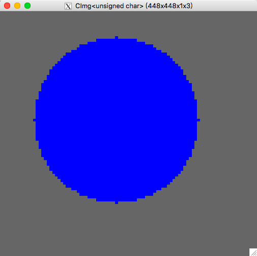

# Ex1:图像读取和显示以及像素操作

### 1

读入 1.bmp 文件，并用 CImg.display() 显示：

创建CImg 对象，读入1.bmp 文件：

```cpp
CImg<unsigned char> bmp1;
bmp1 = CImg<unsigned char>("1.bmp");
```

显示图像：

```cpp
bmp1.display();
```

效果如下：


### 2

把 1.bmp 文件的白色区域变成红色，黑色区域变成绿色:

使用CImg的 cimg_for 宏将rgb 值为#ffffff 和#000000的像素点进行修改：

```cpp
		cimg_forXY(bmp1, x, y) {
            if (bmp1(x, y, 0) == 255 && bmp1(x, y, 1) == 255 && bmp1(x, y, 2) == 255) {
                bmp1(x, y, 1) = 0;
                bmp1(x, y, 2) = 0;
            } else if (bmp1(x, y, 0) == 0 && bmp1(x, y, 1) == 0 && bmp1(x, y, 2) == 0) {
                bmp1(x, y, 1) = 255;
            }
        }
```

效果如下，图像中纯白色和纯黑色部分被改变：


### 3

在图上绘制一个圆形区域，圆心坐标(50,50)，半径为 30，填充颜色为蓝色。 

不用 CImg 函数调用做法是遍历图像中的每个像素，将与圆心坐标距离小于等于30的像素点填充为蓝色。

```cpp
	virtual void drawBlueCircle() {
        cimg_forXY(bmp1, x, y) {
            if (getLength(50, 50, x, y) <= 30) {
                bmp1(x, y, 0) = 0;
                bmp1(x, y, 1) = 0;
                bmp1(x, y, 2) = 255;
            }
        }
    }
```

效果如下:



使用 CImg 函数调用的做法就是直接调用`draw_circle`函数，圆心为（50, 50）半径为30，颜色为蓝色：

```cpp
void drawBlueCircle() {
        unsigned char colorBlue[] = {0, 0, 255};
        bmp1.draw_circle(50, 50, 30, colorBlue);
}
```

效果如下：


可以看到两种方法一个可见的区别就是不使用 CImg的做法会让圆的四个方向多出一个像素点，这是由于对于这四个像素点距离正好为30从而在代码中被填充颜色。

## 4

在图上绘制一个圆形区域，圆心坐标(50,50)，半径为 3，填充颜色为黄色。 

与上题做法类似，不使用 CImg 做法如下：

```cpp
    virtual void drawYellowCircle() {
        cimg_forXY(bmp1, x, y) {
            if (getLength(50, 50, x, y) <= 3) {
                bmp1(x, y, 0) = 255;
                bmp1(x, y, 1) = 255;
                bmp1(x, y, 2) = 0;
            }
        }
    }
```

效果如下：


使用 CImg 做法：

```cpp
void drawYellowCircle() {
        unsigned char colorYellow[] = {255, 255, 0};
        bmp1.draw_circle(50, 50, 3, colorYellow);
    }
```

效果：


CImg 的做法对比起来多填充了几个像素点从而使得图形更接近圆形，而不用 CImg 的做法缺少的几个像素点是因为计算出来的距离大于3而未填充。

整体而言圆形区域的形状效果不好的原因是像素点用整数表示且形状为方块从而使得填充的像素点位置因小数位的舍去会造成误差，当半径较小时误差显示出来较为明显，从而导致显示的形状效果不好。

## 5

在图上绘制一条长为 100 的直线段，起点坐标为(0, 0)，方向角为 35 度，直线的颜色为蓝色。 

不用 CImg 函数调用的做法：先计算出水平方向长度，对水平方向每一像素点计算其对应的垂直方向位置，填充对应的像素点从而画出线。

```cpp
	virtual void drawBlueLine() {
        int xLength = cos(35 * cimg_library::cimg::PI / 180) * 100;
        cimg_forX(bmp1, x) {
            if (x > xLength) break;
            int y = tan(35 * cimg_library::cimg::PI / 180) * x;
            bmp1(x, y, 0) = 0;
            bmp1(x, y, 1) = 0;
            bmp1(x, y, 2) = 255;
        }
    }
```

效果如下：


使用 CImg 函数的方法：计算出中点位置，调用`draw_line`函数

```cpp
	void drawBlueLine() {
        unsigned char colorBlue[] = {0, 0, 255};
        int end_x = cos(35 * cimg_library::cimg::PI / 180) * 100;
        int end_y = sin(35 * cimg_library::cimg::PI / 180) * 100;
        bmp1.draw_line(0, 0, end_x, end_y, colorBlue);
    }
```

效果如下：


## 6

把上面的操作结果保存为 2.bmp。 

直接调用保存的函数即可：

```cpp
	void saveToFile() {
        bmp1.save("2.bmp");
    }
```


## 代码说明

提交代码中，`hw1.h`文件中包含两个类，`hw1` 类包含了以上的各步的函数：

1. `displayImage`
2. `changeColor`
3. `drawBlueCircle`
4. `drawYellowCircle`
5. `drawBlueLine`
6. `saveToFile`

`hw1_CImgImpl`类派生自`hw1`类，用 CImg 的函数调用重写了第3、4、5步。


`hw1-main.cpp`文件中为主函数，运行开始后需输入1或2 来表示是否使用 CImg 的函数调用方法。然后程序会根据输入创建`hw1`或`hw1_CImgImpl`对象，接着先显示出1.bmp的原图，等待1秒后显示出经过修改后的图片，关闭两个图片的窗口后程序会将修改后的图片存入2.bmp。


## 编译方式

### macOS

```sh
g++ -lX11 -L/usr/X11/lib -I/usr/X11/include -std=c++11 hw1-main.cpp -o hw1-mac
```

### Windows

```sh
g++ -std=c++11 hw1-main.cpp -o hw1.exe -lgdi32
```

压缩包中提供了编译好的 Mac 和 Windows 下的可执行文件，命名为`hw1-mac`和`hw1.exe`。